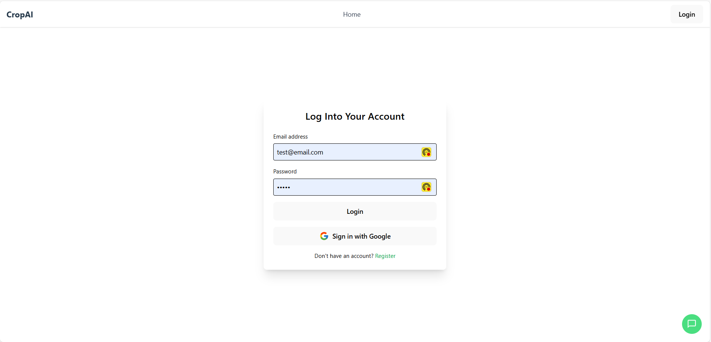
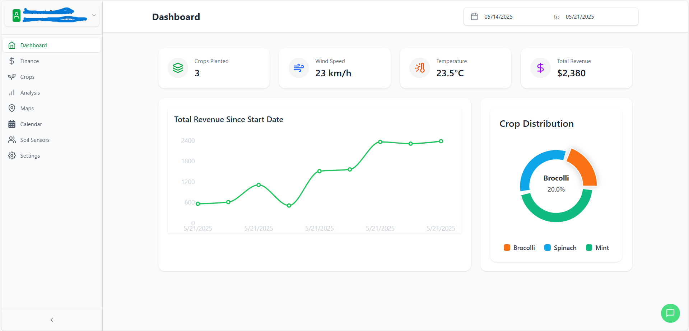
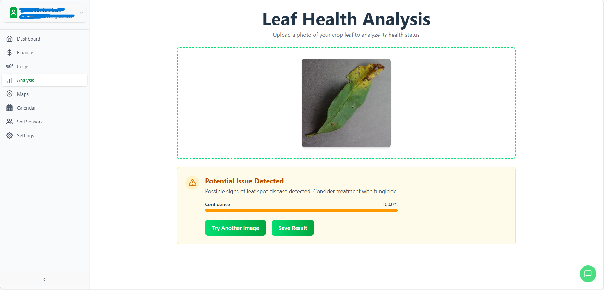
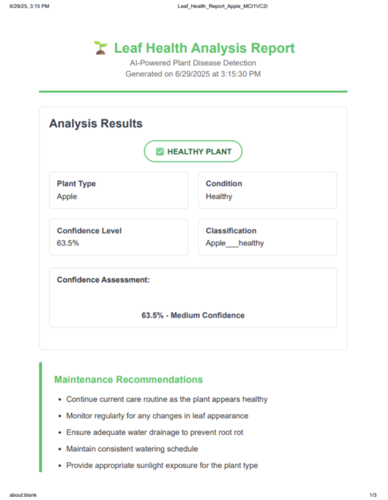

# CropAI

<div align="center">


**Full-stack AI crop management platform with CNN-based plant disease detection, AI-generated crop health reports, farm dashboards, field mapping, financial tracking, and database-backed crop management.**

</div>

---

## Overview

CropAI helps farmers monitor crop health and manage farm operations from one platform.

The main AI pipeline uses a **TensorFlow/Keras CNN** to classify crop leaf images. The model result then feeds into an **AI workflow** that generates a plant health report with diagnosis context, recommendations, and next steps.

---

## Demo Screenshots

### Login



### Dashboard



### AI Leaf Analysis



### AI Health Report



---

## Core Workflow

```text
Leaf Image Upload
        ↓
Image Preprocessing
        ↓
TensorFlow CNN Prediction
        ↓
AI Report Generation
        ↓
Farmer-Friendly Health Report
        ↓
Dashboard / Saved Farm Data
```

---

## Features

| Feature | Description |
|---|---|
| AI Leaf Analysis | Uses a TensorFlow/Keras CNN to classify crop leaf images |
| AI Health Reports | Turns CNN output into diagnosis context and recommendations |
| Crop Management | Add, edit, delete, and view crop records |
| Finance Tracking | Track income, expenses, and operational costs |
| Field Mapping | Store and view farm plot locations with Google Maps-style mapping |
| Soil Data | Add and manage crop-specific soil readings |
| Reminders | Schedule farm tasks and follow-ups |
| Auth | User signup, login, JWT auth, password hashing, and profiles |
| Dashboard | Central view for crop, finance, soil, reminder, and analysis data |

---

## AI / ML

| Component | Details |
|---|---|
| Model | Convolutional Neural Network |
| Framework | TensorFlow / Keras |
| Task | Crop leaf disease classification |
| Optimizer | Adam |
| Accuracy | 86% after tuning |
| Backend Integration | Flask API endpoint |
| Input | Base64 leaf image |

The CNN does not just return a label. Its prediction is passed into an AI workflow that generates a practical report for the farmer.

Example report outputs:

- likely plant health issue
- explanation of the prediction
- recommended next steps
- prevention tips
- follow-up actions

---

## Tech Stack

| Layer | Technologies |
|---|---|
| Frontend | React, TypeScript, Vite, Tailwind CSS |
| UI / Charts | Recharts, React Calendar, React Datepicker, Lucide React, Framer Motion |
| Backend | Flask, Flask-CORS, Flask-Migrate |
| Database | SQLite, SQLAlchemy |
| Auth | Flask-JWT-Extended, Flask-Bcrypt |
| AI / ML | TensorFlow, Keras, CNN |
| APIs | REST APIs, Google Maps-style field mapping |

---

## System Architecture

```text
React + TypeScript Frontend
        ↓
Axios API Requests
        ↓
Flask REST API
        ↓
SQLAlchemy ORM
        ↓
SQLite Database
```

AI analysis flow:

```text
User uploads image
        ↓
Frontend sends image to Flask
        ↓
Backend preprocesses image
        ↓
TensorFlow CNN predicts crop health
        ↓
AI workflow generates report
        ↓
Report returns to dashboard
```

---

## Database Modules

| Module | Purpose |
|---|---|
| Users | Stores accounts and profile data |
| Crops | Stores crop records |
| Finances | Stores income and expense records |
| Soil Data | Stores crop-specific soil readings |
| Reminders | Stores scheduled farm tasks |
| Field Plots | Stores mapped farm locations |
| Analysis | Handles image analysis and model results |

---

## API Reference

### Auth

| Route | Method | Description |
|---|---|---|
| `/signup` | POST | Create user |
| `/logintoken` | POST | Login and return JWT |
| `/logout` | POST | Logout |
| `/profile/<email>` | GET | Fetch profile |
| `/profile/<email>` | PUT | Update profile |

### Crops

| Route | Method | Description |
|---|---|---|
| `/crops` | GET, POST | List or create crops |
| `/crops/<crop_id>` | GET, PUT, DELETE | Get, update, or delete crop |

### Finances

| Route | Method | Description |
|---|---|---|
| `/finances` | GET, POST | List or create finance records |
| `/finances/<finance_id>` | PUT, DELETE | Update or delete finance record |

### AI / Model

| Route | Method | Description |
|---|---|---|
| `/api/check-model` | POST | Verify model file exists |
| `/api/analyze-leaf` | POST | Run CNN leaf disease analysis |

### Farm Management

| Route | Method | Description |
|---|---|---|
| `/api/plots` | GET, POST | Manage field-map plots |
| `/api/reminders` | GET, POST | Manage reminders |
| `/api/reminders/<reminder_id>` | PUT, DELETE | Update or delete reminder |
| `/api/soil-data` | POST | Create soil reading |
| `/api/soil-data/<crop_id>` | GET | Get soil readings for crop |
| `/api/soil-data/<soil_id>` | PUT, DELETE | Update or delete soil reading |

---

## Getting Started

### Prerequisites

- Node.js
- Python 3.8+
- Git

### Clone

```bash
git clone https://github.com/psamin/crop2.0.git
cd crop2.0
```

### Frontend

```bash
cd client
npm install
npm run dev
```

Frontend runs at:

```text
http://localhost:5173
```

### Backend

```bash
cd server
python3 -m venv venv
source venv/bin/activate
pip install -r requirements.txt
flask db upgrade
flask run
```

Backend runs at:

```text
http://localhost:5000
```

---

## Results

| Result | Detail |
|---|---|
| Competition | 2nd Internationally at TSA Software Development |
| Model | TensorFlow CNN for crop leaf classification |
| Accuracy | 86% after tuning |
| AI Workflow | CNN result feeds into generated crop health report |
| Product | Full-stack crop management dashboard |
| Database | Crop, finance, soil, reminder, plot, and user data |
| Mapping | Google Maps-style field plot tracking |
| Investment | Turned down a $10,000 investment offer |

---

## What I Learned

CropAI taught me how to connect machine learning to a real product workflow.

The main challenge was not just training a CNN. It was integrating model predictions into a useful system with backend APIs, persistent database records, dashboards, maps, and AI-generated recommendations.

Key skills practiced:

- TensorFlow/Keras CNN development
- ML inference through Flask
- REST API design
- SQLAlchemy database management
- JWT authentication
- React/TypeScript frontend development
- AI workflow design around model outputs

---

## Repository

https://github.com/psamin/crop2.0
