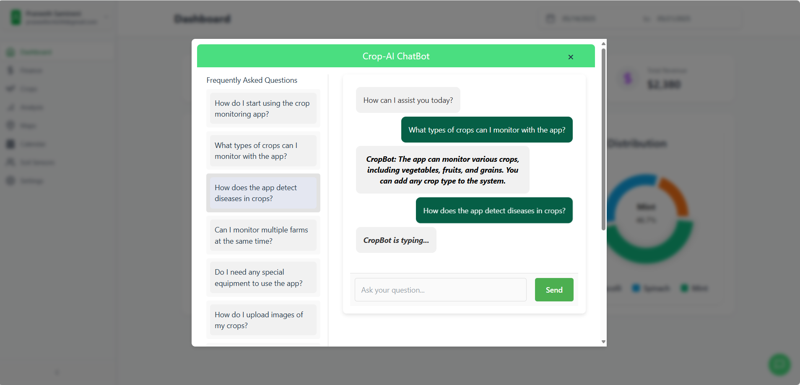

# CropAI

Smart Crop Management. CropAI helps farmers track, analyze, and optimize their crops through a modern web interface and an AI model for disease detection.

---

## Table of Contents

* [About The Project](#about-the-project)
  * [Built With](#built-with)
  * [Screenshots](#screenshots)
  * [Getting Started](#getting-started)
  * [Dependencies](#dependencies)
* [Usage](#usage)
* [API Reference](#api-reference)
* [Contributing](#contributing)

---

## About The Project

CropAI combines a React/TypeScript frontend, a Flask backend, and a TensorFlow CNN model to deliver:

* **Account & Profile Management**
* **Crop & Finance Tracking**
* **Interactive Field Mapping**
* **Reminders & Calendar**
* **AI-powered Leaf Disease Detection**

### Built With

* **Frontend:** Vite, React, TypeScript, Tailwind CSS, lucide-react  
* **Backend:** Flask, SQLAlchemy, Flask-Migrate, JWT Auth, Flask-Bcrypt  
* **AI/ML:** TensorFlow/Keras (Adam optimizer)  
* **Database:** SQLite  

### Screenshots

#### Dashboard


#### AI ChatBot



#### Leaf Health Analysis


#### Maps


#### Login


---

## Getting Started

Follow these steps to get a local copy up and running.

### Prerequisites

* **Node.js**  
* **Python 3.8+**  
* **Git**  

### Installation

1. **Clone the repo**

   ```bash
   git clone <your-repo-url>
   cd cropAI
   ```

2. **Frontend setup**

   ```bash
   cd client
   npm install
   npm run dev
   # Visit http://localhost:5173
   ```

3. **Backend setup**

   ```bash
   cd server
   python3 -m venv venv
   source venv/bin/activate    # (Windows) venv\Scripts\activate.ps1
   pip install -r requirements.txt
   flask db upgrade          
   flask run                
   ```

---

## Dependencies

#### Frontend

These are the direct packages our React app uses (installed via `npm install` in `client/`):

- @react-oauth/google@0.12.2  
- @tailwindcss/vite@4.1.0  
- axios@1.8.4  
- bootstrap@5.3.5  
- flowbite-react@0.11.7  
- font-awesome@4.7.0  
- framer-motion@12.7.4  
- lucide-react@0.501.0  
- react-calendar@5.1.0  
- react-countup@6.5.3  
- react-datepicker@8.3.0  
- react-dom@19.1.0  
- react-dropzone@14.3.8  
- react-icons@5.5.0  
- react-parallax@3.5.2  
- react-router-dom@7.6.0  
- react@19.1.0  
- recharts@2.15.2  
- router-dom@3.0.3  
- tailwindcss@4.1.3  

#### Backend

Install all Python dependencies with:

```bash
cd server
source venv/bin/activate     # or venv\Scripts\activate.ps1 on Windows
pip install -r requirements.txt
```

And generate `requirements.txt` via:

```bash
pip freeze > requirements.txt
```

Your `requirements.txt` should look like:

```
absl-py==2.2.2
aiohappyeyeballs==2.6.1
aiohttp==3.11.16
aiosignal==1.3.2
alembic==1.15.2
annotated-types==0.7.0
anyio==4.9.0
astunparse==1.6.3
attrs==25.3.0
Authlib==1.5.2
banks==2.1.1
bcrypt==4.3.0
beautifulsoup4==4.13.3
blinker==1.9.0
cachelib==0.13.0
certifi==2025.1.31
cffi==1.17.1
charset-normalizer==3.4.1
click==8.2.0
colorama==0.4.6
cryptography==45.0.2
dataclasses-json==0.6.7
Deprecated==1.2.18
dirtyjson==1.0.8
distro==1.9.0
filetype==1.2.0
Flask==3.1.1
Flask-Bcrypt==1.0.1
flask-cors==6.0.0
Flask-JWT-Extended==4.7.1
Flask-Migrate==4.1.0
Flask-OAuthlib==0.9.6
Flask-SQLAlchemy==3.1.1
flatbuffers==25.2.10
frozenlist==1.5.0
fsspec==2025.3.2
gast==0.6.0
google-pasta==0.2.0
greenlet==3.2.2
griffe==1.7.2
grpcio==1.71.0
h11==0.14.0
h5py==3.13.0
httpcore==1.0.7
httpx==0.28.1
idna==3.10
itsdangerous==2.2.0
Jinja2==3.1.6
jiter==0.9.0
joblib==1.4.2
keras==3.10.0
libclang==18.1.1
llama-cloud==0.1.17
llama-cloud-services==0.6.9
llama-index==0.12.28
llama-index-agent-openai==0.4.6
llama-index-cli==0.4.1
llama-index-core==0.12.28
llama-index-embeddings-openai==0.3.1
llama-index-indices-managed-llama-cloud==0.6.11
llama-index-llms-openai==0.3.30
llama-index-multi-modal-llms-openai==0.4.3
llama-index-program-openai==0.3.1
llama-index-question-gen-openai==0.3.0
llama-index-readers-file==0.4.7
llama-index-readers-llama-parse==0.4.0
llama-parse==0.6.4.post1
Mako==1.3.10
Markdown==3.8
markdown-it-py==3.0.0
MarkupSafe==3.0.2
marshmallow==3.26.1
mdurl==0.1.2
ml_dtypes==0.5.1
multidict==6.3.2
mypy-extensions==1.0.0
namex==0.0.9
nest-asyncio==1.6.0
networkx==3.4.2
nltk==3.9.1
numpy==2.1.3
oauthlib==2.1.0
openai==1.70.0
opt_einsum==3.4.0
optree==0.15.0
packaging==24.2
pandas==2.2.3
pillow==11.1.0
platformdirs==4.3.7
propcache==0.3.1
protobuf==5.29.4
pycparser==2.22
pydantic==2.11.2
pydantic_core==2.33.1
Pygments==2.19.1
PyJWT==2.10.1
pypdf==5.4.0
python-dateutil==2.9.0.post0
python-dotenv==1.1.0
pytz==2025.2
PyYAML==6.0.2
regex==2024.11.6
requests==2.32.3
requests-oauthlib==1.1.0
rich==14.0.0
six==1.17.0
sniffio==1.3.1
soupsieve==2.6
SQLAlchemy==2.0.41
striprtf==0.0.26
tenacity==9.1.2
tensorboard==2.19.0
tensorboard-data-server==0.7.2
tensorflow==2.19.0
tensorflow-io-gcs-filesystem==0.31.0
termcolor==3.1.0
tiktoken==0.9.0
tqdm==4.67.1
typing-inspect==0.9.0
typing-inspection==0.4.0
typing_extensions==4.13.2
tzdata==2025.2
urllib3==2.3.0
Werkzeug==3.1.3
wrapt==1.17.2
yarl==1.18.3
```

## Usage

[Back to top](#table-of-contents)

### Running the Full Stack

* **Frontend:** hot-reload at `http://localhost:5173`
* **Backend:** serves JSON API at `http://localhost:5000`

After logging in or signing up, explore:

* **Dashboard** – View summaries
* **Crops** – Add/edit/delete crop records
* **Finances** – Track expenses & income
* **Analysis** – Upload an image of your crop leaf to see if it is healthy or diseased
* **Maps** – Pin and view field locations
* **Settings** – Manage account & notifications
* **Calendar** – Schedule reminders

## API Reference

| Route                             | Method           | Description                                                      |
| --------------------------------- | ---------------- | ---------------------------------------------------------------- |
| `/signup`                         | POST             | Create a new user                                                |
| `/logintoken`                     | POST             | Login and retrieve a JWT                                         |
| `/logout`                         | POST             | Clear JWT cookie (logout)                                        |
| `/profile/<email>`                | GET              | Fetch user profile by email                                      |
| `/profile/<email>`                | PUT              | Update user name, email, and/or password                         |
| `/crops`                          | GET, POST        | List all crops or add a new crop                                 |
| `/crops/<crop_id>`                | GET, PUT, DELETE | Retrieve, update, or delete a single crop                        |
| `/finances`                       | GET, POST        | List all finance records or add a new one                        |
| `/finances/<finance_id>`          | PUT, DELETE      | Update or delete a finance record                                |
| `/api/plots`                      | GET, POST        | List all field-map plots or create a new plot                    |
| `/api/reminders`                  | GET, POST        | List all reminders or add a new one                              |
| `/api/reminders/<reminder_id>`    | PUT, DELETE      | Update or delete a reminder                                      |
| `/api/check-model`                | POST             | Verify that the model file exists                                |
| `/api/analyze-leaf`               | POST             | Run leaf disease detection on a Base64 image                     |
| `/api/soil-data`                  | POST             | Create a new soil reading for a crop                             |
| `/api/soil-data/<crop_id>`        | GET              | List all soil readings for a given crop                          |
| `/api/soil-data/<soil_id>`        | PUT, DELETE      | Update or delete a specific soil reading                         |

## Contributing

1. Fork the repository
2. Create your feature branch (`git checkout -b feature/YourFeature`)
3. Commit your changes (`git commit -m 'Add feature'`)
4. Push to the branch (`git push origin feature/YourFeature`)
5. Open a Pull Request

Please adhere to existing coding standards and include tests where applicable.
